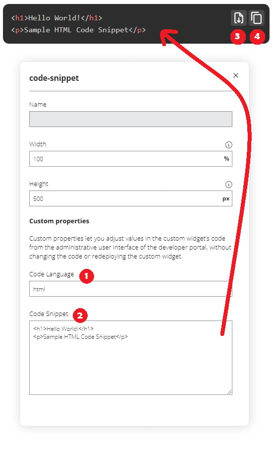

# Code Snippet Widget
The code snippet widget allows you to display code with syntax highlights, 
using the Prism.js library to highlight the code.

## Supported Languages
The currently supported languages are listed below. More languages can be added by updating 
the widget with the appropriate styles and scripts from [prismjs.com](https://prismjs.com).

 - HTML/XML
 - CSS
 - JS
 - JSON
 - C
 - C#
 - Bash
 - Batch
 - Powershell

<small>Note: The HTML/XML and the C and C# languages are included using the Markup and 
C-like language packs, so similar languages are included as well.</small>

## Usage
Include the widget using the `Add Widget` functionality of the Developer Portal site editor.

Click on the widget and choose the `Edit Widget` button to edit the snippet values.

Type one of the supported languages into the Code Language input (1), then paste your code
 snippet into the Code Snippet textarea (2).

Prism will automatically highlight the syntax of the code in the widget on the page.

The widget also includes download (3) and copy (4) buttons on the top right of the widget.

## Example

