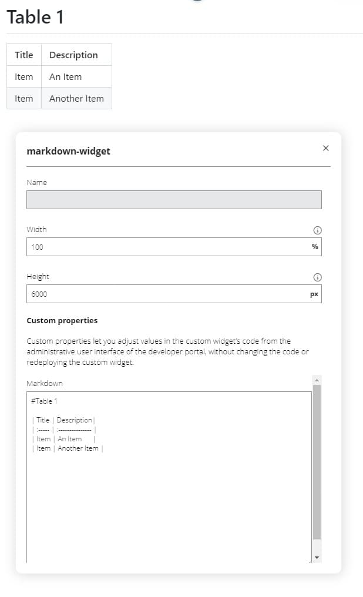

# Markdown Widget
The markdown widget allows you to display markdown content in the portal. 
It utilizes the [Showdown](https://showdownjs.com) library to convert the markdown to html.
 
The markdown widget was developed to display tables, as the table functionality of the portal was broken.

## Usage
Include the widget using the `Add Widget` functionality of the Developer Portal site editor.

Click on the widget and choose the `Edit Widget` button to edit the values.

Write or paste your markdown content in the markdown textarea.

If you have an existing table, you can use https://markdown-convert.com/en/tool/table to convert the table to markdown.

## Example

